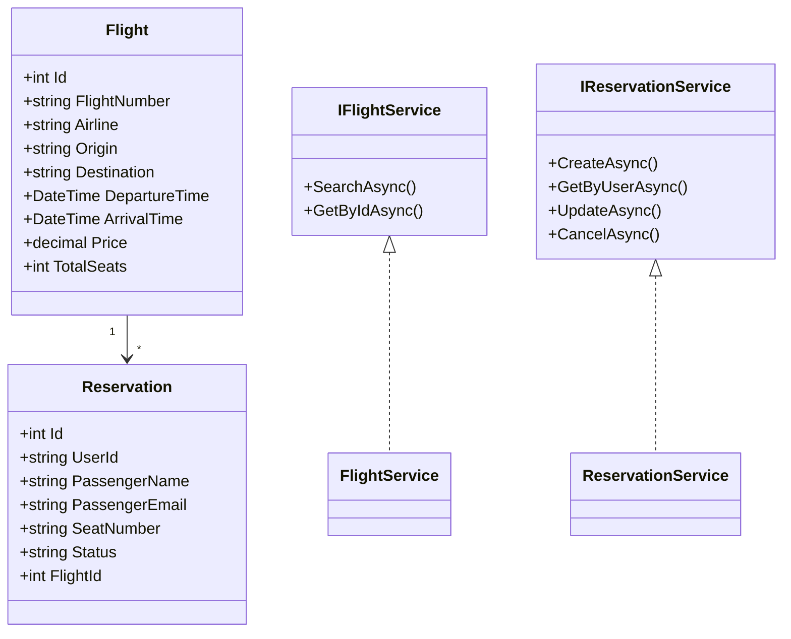

# Diagrama de clases

```mermaid
classDiagram
    class Flight {
      +int Id
      +string FlightNumber
      +string Airline
      +string Origin
      +string Destination
      +DateTime DepartureTime
      +DateTime ArrivalTime
      +decimal Price
      +int TotalSeats
    }
    class Reservation {
      +int Id
      +string UserId
      +string PassengerName
      +string PassengerEmail
      +string SeatNumber
      +string Status
      +int FlightId
    }
    class IFlightService {
      +SearchAsync()
      +GetByIdAsync()
    }
    class FlightService
    class IReservationService {
      +CreateAsync()
      +GetByUserAsync()
      +UpdateAsync()
      +CancelAsync()
    }
    class ReservationService
    Flight "1" --> "*" Reservation
    IFlightService <|.. FlightService
    IReservationService <|.. ReservationService
```
