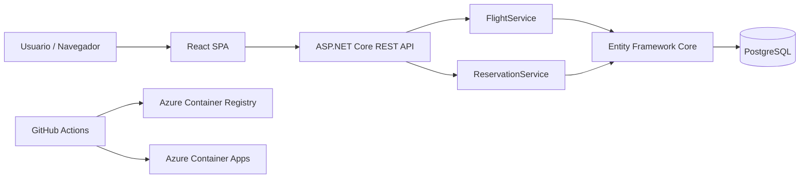

# Diagrama de componentes

```mermaid
flowchart LR
    U[Usuario / Navegador] --> UI[React SPA]
    UI --> API[ASP.NET Core REST API]
    API --> FS[FlightService]
    API --> RS[ReservationService]
    FS --> EF[Entity Framework Core]
    RS --> EF
    EF --> DB[(PostgreSQL)]
    GH[GitHub Actions] --> ACR[Azure Container Registry]
    GH --> ACA[Azure Container Apps]
```
