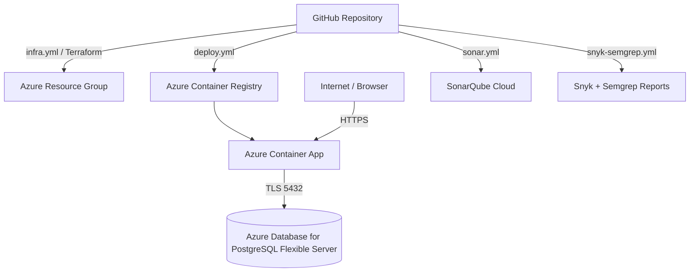

# Diagrama de despliegue

```mermaid
flowchart TB
    DEV[GitHub Repository] -->|infra.yml / Terraform| AZ[Azure Resource Group]
    DEV -->|deploy.yml| ACR[Azure Container Registry]
    ACR --> ACA[Azure Container App]
    USER[Internet / Browser] -->|HTTPS| ACA
    ACA -->|TLS 5432| PG[(Azure Database for PostgreSQL Flexible Server)]
    DEV -->|sonar.yml| SONAR[SonarQube Cloud]
    DEV -->|snyk-semgrep.yml| SEC[Snyk + Semgrep Reports]
```
