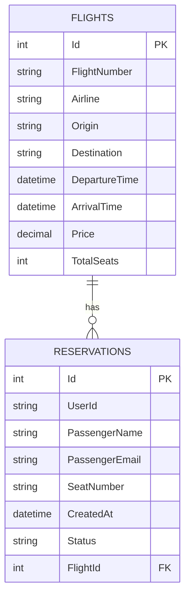

# Diagrama entidad-relación

```mermaid
erDiagram
    FLIGHTS ||--o{ RESERVATIONS : has
    FLIGHTS {
      int Id PK
      string FlightNumber
      string Airline
      string Origin
      string Destination
      datetime DepartureTime
      datetime ArrivalTime
      decimal Price
      int TotalSeats
    }
    RESERVATIONS {
      int Id PK
      string UserId
      string PassengerName
      string PassengerEmail
      string SeatNumber
      datetime CreatedAt
      string Status
      int FlightId FK
    }
```
